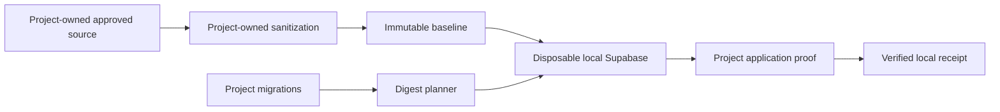

# Glossary and architecture

**Baseline** — immutable sanitized starting artifact.

**Candidate migration** — ordered migration suffix not represented by the baseline.

**Candidate digest** — checksum binding the exact candidate filenames and bytes.

**Project-owned** — application-specific policy or code that remains outside the package.

**Represented migration** — historical migration whose exact bytes are bound into the
baseline.

**Runtime** — disposable, writable local Supabase/PostgreSQL environment.

**Sanitization policy** — exhaustive project decision for every exported field.

**Verified receipt** — local evidence that the exact runtime and candidate suffix passed.

The reusable package owns the path from a completed baseline plus migration directory to
a verified local runtime. The consuming project owns everything that decides which source
data is allowed, how it is transformed, and what application behavior counts as correct.
